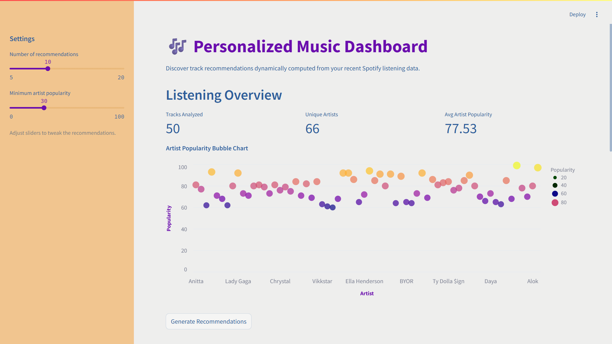
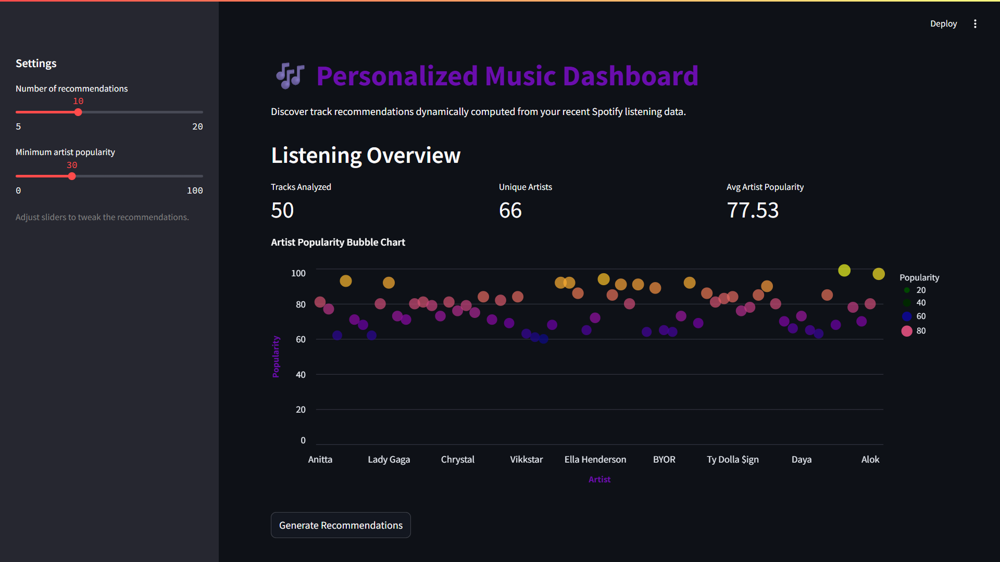
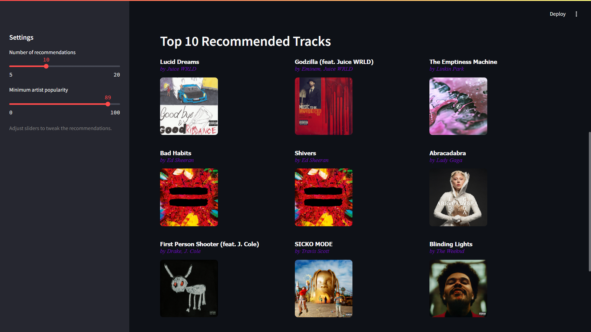
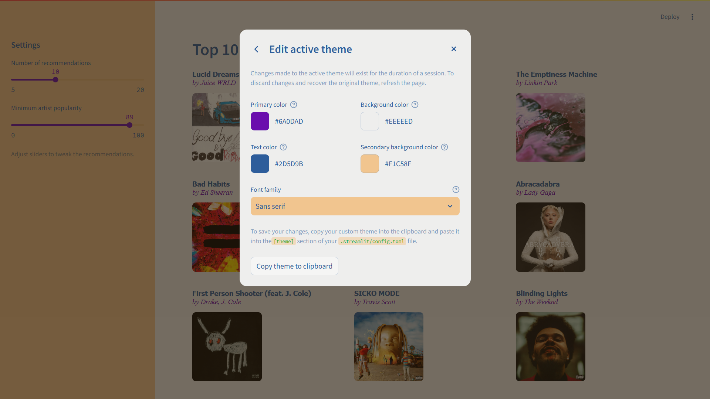
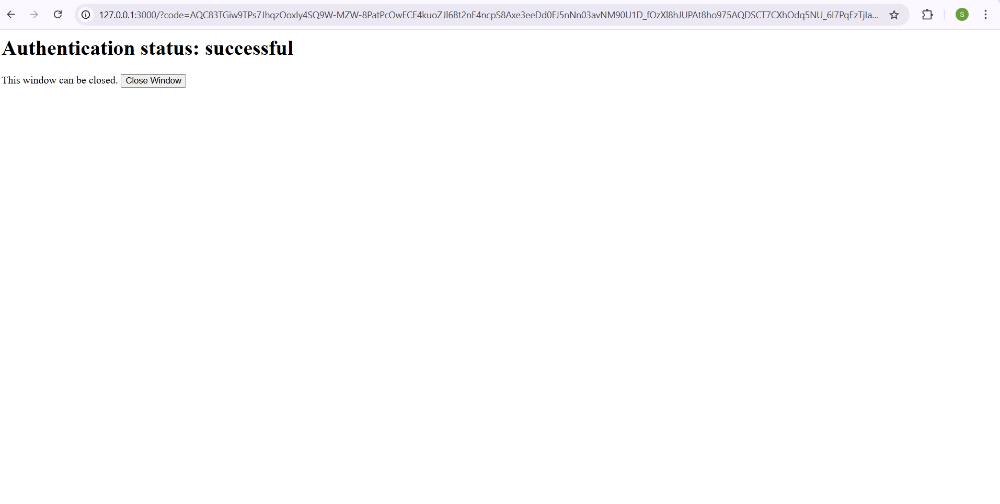

# Personalised Music Recommender

The Spotify Music Recommender is an interactive web application that connects to your Spotify account and delivers personalized track recommendations based on your recent listening history. Built with Streamlit and powered by the Spotify Web API (via Spotipy), the app analyzes track and artist popularity metrics to create a simple user profile, then ranks songs that best match your preferences. Its clean and responsive interface includes customizable sliders for recommendation tuning and an Altair-powered bubble chart for visualizing artist popularity.

## Features
- Log in securely with your Spotify account.
- Fetch your 50 most recently played songs.
- Bubble chart showing popularity of your favorite artists.
- Suggests tracks based on similarity to your recent listening profile.
- Styled dashboard with album covers, previews, and artist info.

## Setup
1. Install dependencies:
   ```bash
   pip install -r requirements.txt
   ```
2. Add your Spotify API credentials to Streamlit secrets.
3. Run the app:
   ```bash
   streamlit run recommender.py
   ```

## Files
- `recommender.py`: Main app
- `requirements.txt`: Python dependencies
- `.gitignore`: Recommended ignores
- `README.md`: Project info

## Screenshots

### Dashboard Overview (Light Theme)
Shows the main dashboard UI with sidebar controls, metrics, and artist popularity bubble chart.


### Dashboard Overview (Dark Theme)
Shows the dashboard UI in dark theme, including sidebar, metrics, and bubble chart.


### Top 10 Recommended Tracks (Light Theme)
Displays the recommended tracks grid in light theme, with album art and artist info.


### Top 10 Recommended Tracks (Dark Theme)
Displays the recommended tracks grid in dark theme, with album art and artist info.


### Settings Dialog
Displays the Streamlit settings dialog, including wide mode and theme selection options.


### Theme Customization
Shows the theme customization panel for adjusting colors and fonts.


### Authentication Success
Shows the successful authentication status after logging in with Spotify.


### Spotify Login
The Spotify login screen that appears during first-time authentication.


