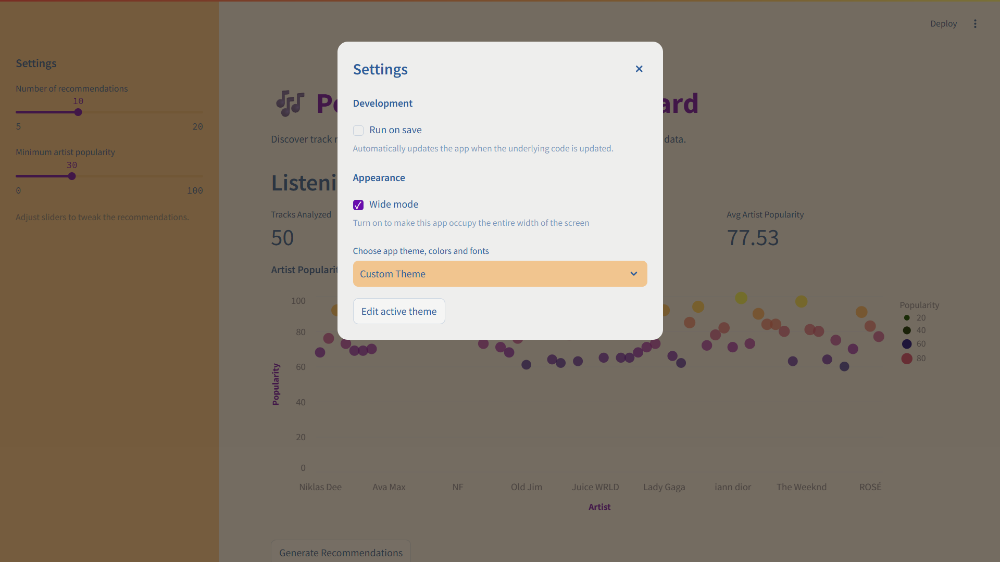

# Spotify Music Recommender

A personalized music recommender dashboard built with Streamlit and Spotify API.

## Features
- Connects to your Spotify account
- Analyzes recent listening history
- Visualizes artist popularity
- Recommends tracks based on your profile

## Setup
1. Install dependencies:
   ```bash
   pip install -r requirements.txt
   ```
2. Add your Spotify API credentials to Streamlit secrets.
3. Run the app:
   ```bash
   streamlit run recommender.py
   ```

## Files
- `recommender.py`: Main app
- `requirements.txt`: Python dependencies
- `.gitignore`: Recommended ignores
- `README.md`: Project info

## Screenshots

### Dashboard Overview (Light Theme)
Shows the main dashboard UI with sidebar controls, metrics, and artist popularity bubble chart.


### Dashboard Overview (Dark Theme)
Shows the dashboard UI in dark theme, including sidebar, metrics, and bubble chart.


### Top 10 Recommended Tracks (Light Theme)
Displays the recommended tracks grid in light theme, with album art and artist info.


### Top 10 Recommended Tracks (Dark Theme)
Displays the recommended tracks grid in dark theme, with album art and artist info.


### Settings Dialog
Displays the Streamlit settings dialog, including wide mode and theme selection options.


### Theme Customization
Shows the theme customization panel for adjusting colors and fonts.


### Authentication Success
Shows the successful authentication status after logging in with Spotify.


### Spotify Login
The Spotify login screen that appears during first-time authentication.


